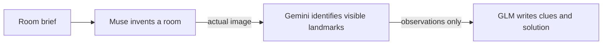
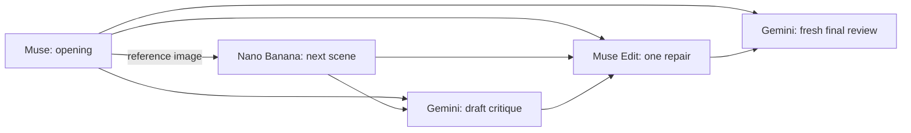
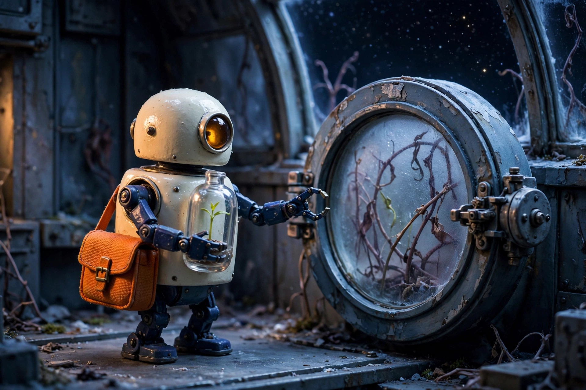
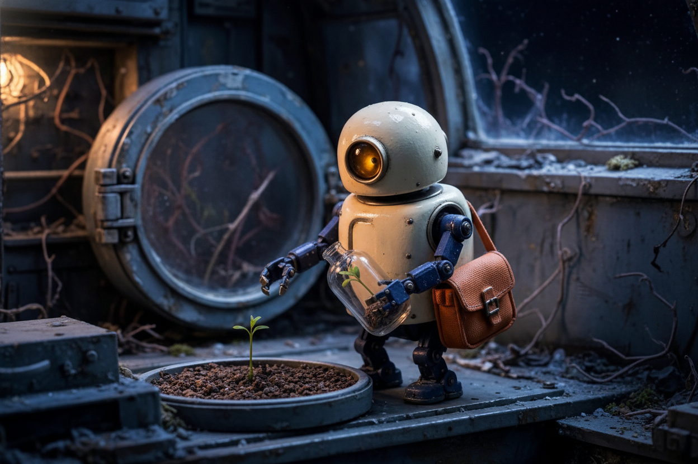
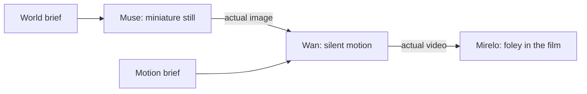

# Three compositions, with the work visible

These September 12, 2026 runs test whether a combination makes something worth exploring: an illustrated puzzle, a story that goes through an actual revision, and a miniature film with sound generated from its motion. The [exploration report](../docs/examples-rebuild-2026-09-12.md) explains the historical choices and how the gallery, executors, skills and finished apps fit together.

All three final graphs ran on their default and a substantially different alternate brief. The six selected executions completed with their promised outputs and no capture errors. Quality is qualified below: the storyboard retains continuity errors, the attic story contradicts a lighting detail, and audio review does not establish precise synchronization. These are agent-reviewed examples, not outside playtests or adoption evidence.

The [selection manifest](selection.json) identifies the six final captures. Each retains its exact source graph, input overrides, criteria, every captured node output, hashes, timings and reported charges. `run.json` records execution and remains explicitly unreviewed at capture time; a separate `review.json` records the later judgment. Earlier attempts remain intact.

| Composition | Model calls per run | Default charge | Alternate charge | Selected result |
| --- | ---: | ---: | ---: | --- |
| Pocket mystery | 3 | $0.011562 | $0.011463 | Both puzzles have one valid order; attic prose has a visible mismatch. |
| Storyboard relay | 5 | $0.065279 | $0.065511 | Repair fixes concrete errors in both stories; other errors remain. |
| Tiny world film | 3 | $0.181765 | $0.181765 | Both produce five-second videos with distinct soundtracks; material and audio limits are recorded. |

The six selected generations cost **$0.517344**. All **13 generation attempts / 43 completed model calls** cost **$1.020452**, including the unsuccessful attempts. Two separate audio-review calls cost **$0.002164**, for **$1.022615 total observed charges**. The [full cost ledger](cost-ledger.json) preserves unrounded values. GLM text calls reported zero on this account; the public catalog lists paid token pricing and subscription inclusion. These are historical account charges, not universal prices or spending caps.

## Pocket mystery



The observer does not receive the generation prompt. The writer receives the observed landmarks, so a requested object that the image omitted cannot enter directly from the original brief. An observer can still misread an image; its record is an inspectable intermediate, not ground truth.


The default [player handout](pocket-mystery/moon-menders-attic-2026-09-12T14-01-59-781Z/player.txt) uses the actual crescent, telescope and sewing machine. The [observations](pocket-mystery/moon-menders-attic-2026-09-12T14-01-59-781Z/observe-text.txt), [complete output with spoilers](pocket-mystery/moon-menders-attic-2026-09-12T14-01-59-781Z/mystery-text.txt), [six-order check](pocket-mystery/moon-menders-attic-2026-09-12T14-01-59-781Z/puzzle-check.json) and [review](pocket-mystery/moon-menders-attic-2026-09-12T14-01-59-781Z/review.json) let a reader audit the connection. The clues are uniquely solvable. The narrative still calls the visibly glowing moon dim; the landmark list also happens to match the answer order. That limits the handout's polish and difficulty.

The alternate [Submarine Bakery illustration](pocket-mystery/submarine-bakery-2026-09-12T14-02-00-934Z/illustration-image.jpg) yields a different activity about a sunken choir. It uses a visible brick dome, bell and spiral shell. Its [complete handout and solution](pocket-mystery/submarine-bakery-2026-09-12T14-02-00-934Z/mystery-text.txt), [order check](pocket-mystery/submarine-bakery-2026-09-12T14-02-00-934Z/puzzle-check.json) and [review](pocket-mystery/submarine-bakery-2026-09-12T14-02-00-934Z/review.json) show that the editable room input changes the content. This is the cleaner handout, although its facilitator hint gives away the middle landmark. Neither case is an interactive game or an external playtest.

Earlier wording introduced an ambiguous “first kind word” clue. Review prompted a constrained format with two explicit `Visit A before B.` statements. The final checks enumerate all six permutations against those actual statements. [Detailed review notes](../docs/pocket-mystery-review-notes.md) preserve the rejected wording and the residual narrative problem.

## Storyboard relay



The first three-stage prototype stopped at criticism. Its robot draft duplicated the seedling, so the critique earned an additional image-edit step. The final graph makes exactly one revision, even when the initial critic reports no mismatch. A fresh final reader sees the original and repaired image with the story requirements, without the earlier verdict.

| Opening | Draft next frame | Repaired next frame |
| --- | --- | --- |
|  |  |  |

The repair removes the duplicate plant and improves the crouching pose. The hatch remains closed despite the requested open hatch. Read the actual [draft critique](storyboard-relay/orbital-delivery-2026-09-12T14-01-14-715Z/review-text.txt), [final critique](storyboard-relay/orbital-delivery-2026-09-12T14-01-14-715Z/final-review-text.txt) and [visual review](storyboard-relay/orbital-delivery-2026-09-12T14-01-14-715Z/review.json). The example demonstrates an effective correction with remaining flaws; it does not pass every continuity requirement.

The cut-paper crab alternate advances from a grounded kite to flight. Compare its [opening](storyboard-relay/salt-lagoon-kite-2026-09-12T14-02-02-099Z/frame-one-image.webp), [draft](storyboard-relay/salt-lagoon-kite-2026-09-12T14-02-02-099Z/frame-two-image.png) and [repair](storyboard-relay/salt-lagoon-kite-2026-09-12T14-02-02-099Z/repair-image.webp): the revision restores a missing reel and the pink sky/sun. Bow count and placement still drift. The [final review](storyboard-relay/salt-lagoon-kite-2026-09-12T14-02-02-099Z/final-review-text.txt) exposes that failure. More stages would require another demonstrated reason, not an assumption that longer graphs are better.

## Tiny world film



| Case | Source | Motion before sound | Film with generated foley |
| --- | --- | --- | --- |
| Walnut-shell watermill | [Still](tiny-world-film/default-2026-09-12T13-56-05-839Z/n3-image.webp) | [Silent take](tiny-world-film/default-2026-09-12T13-56-05-839Z/n4-video.mp4) | [Watch film](tiny-world-film/default-2026-09-12T13-56-05-839Z/n5-video.mp4) |
| Mechanical moth | [Still](tiny-world-film/alternate-2026-09-12T13-58-59-068Z/n3-image.webp) | [Silent take](tiny-world-film/alternate-2026-09-12T13-58-59-068Z/n4-video.mp4) | [Watch film](tiny-world-film/alternate-2026-09-12T13-58-59-068Z/n5-video.mp4) |

Both final files contain five seconds of H.264 video at 832×480 plus mono AAC audio. Each input take is 5.03125 seconds and contains video only. The stored `media-probe.json` reports the final container and streams. Sampled frames show wheel rotation in the default and wing movement in the alternate; the moth develops orange undersides instead of retaining an entirely brass appearance.

Gemini received extracted WAV audio without either scene brief. Its [watermill review](tiny-world-film/default-2026-09-12T13-56-05-839Z/audio-review.json) describes rushing/splashing water and friction; its [moth review](tiny-world-film/alternate-2026-09-12T13-58-59-068Z/audio-review.json) describes rhythmic metallic friction and clicks. Both report no speech or music and a sharp ending. These are model-assisted observations, not human listening or a precise timing measurement. The reviewer's approximate 5.1-second timestamps do not override the measured five-second media duration. No seamless loop is claimed.

The initial graph incorrectly used a one-input Combine node to expose the silent take. Combine requires two clips, so both early runs completed their paid stages and then failed locally. Those attempts are retained and charged in the ledger. The final graph exports the first frame and completed film; the capture harness retains the silent intermediate without fabricating an extra public sink.

## Reproduce and audit

The [runtime record](environment.json) pins the executor revision and local tools used. The [selected catalog snapshot](catalogs-2026-09-12.json) preserves dated model capabilities and pricing from the provider's public [chat](https://nano-gpt.com/api/v1/models?detailed=true), [image](https://nano-gpt.com/api/v1/image-models) and [video](https://nano-gpt.com/api/v1/video-models) catalogs. WAN's explicit `480p`, `81` frames and `16` fps model options keep headless runs from silently inheriting its higher-resolution default. The foley duration field supports a cost estimate; it is not a supported provider duration control. The observed foley charge was $0.06 per clip, so do not treat the catalog's approximately $0.05 forecast as a cap.

From this repository, with Node 20+, `ffmpeg`, and the JavaScript executor installed:

```bash
# Inspect only: no key, network request or generation.
node scripts/capture-example.mjs pocket-mystery --case submarine-bakery

# Check all six graph compositions with mocked provider responses.
node scripts/check-composition.mjs
npm test

# Explicitly generate a fresh case using NANOGPT_API_KEY from the environment.
# This spends the configured account's NanoGPT balance.
node scripts/capture-example.mjs storyboard-relay --case salt-lagoon-kite --run
```

Pass `--executor /path/to/nanoodle-js/src/index.mjs` to use a source checkout. Optional `--catalogs /directory` reads full `chat.json`, `image.json`, `video.json` and `audio.json` catalog responses locally; the compact audit snapshot is not that directory. Use the [generated recipes](../recipes/) for JavaScript and Python invocation and each workflow's output contract. The new fixtures contain alternate input overrides and review criteria, not predetermined generated answers.

The capture harness saves partial execution results, rejects missing promised outputs, and handles both primary image outputs and image arrays. Four early attempts also exposed its original array-capture error; their primary media files remain available, and the failures are not relabeled as complete captures. Offline tests cover successful, empty and failed captures, and verify actual artifact handoffs in the three compositions. Checksums guard the saved evidence from accidental replacement; they cannot judge creative quality.

The [final validation record](validation/checks.json) includes the repository checks and their limits. Desktop and mobile [browser checks](validation/browser.json) opened all three new graphs, loaded their guide pages and images, played both sample clips, and confirmed that GM spoilers start hidden. The storyboard displays its three images together on desktop, with both model reviews available to expand. Saved screenshots show the [example cards](validation/cards-1440.png), [storyboard comparison](validation/storyboard-relay-1440.png) and [mobile puzzle](validation/pocket-mystery-390.png). Browser checks made no paid calls.

The subsequent showcase pass leads the editor, gallery and guide hub with all three new compositions. Each gallery entry and guide also exposes its alternate run, including actual input values and an importable graph with those overrides applied. The captured source graph and run record remain separate from that prepared alternate graph. The [showcase browser report](validation/showcase-browser.json) verifies both viewport sizes, all alternate results and share links, hidden GM answers, and playback of all four silent/sounded clips. See the [featured row](validation/featured-1440.png), [mobile showcase](validation/featured-390.png), [crab comparison](validation/storyboard-relay-alternate-1440.png) and [guide hub](validation/discovery-hub-1440.png). This presentation work reused the reviewed captures and made no additional paid calls.

Model requests go directly to NanoGPT/providers. Credentials stay in the local environment; these evidence records exclude credentials and account balances. Viewing the static samples makes no inference calls. This rebuild adds no analytics or content-seeing service.
